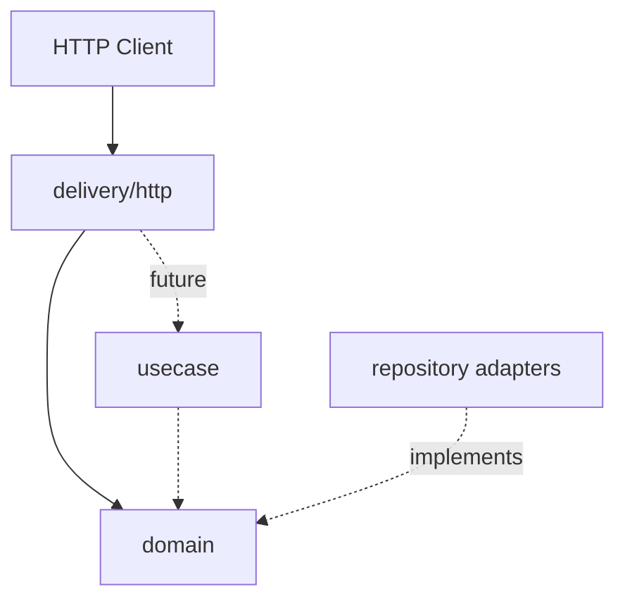

# Task Manager Microservice

A small Go backend that manages to-do tasks over a REST API. Built with clean architecture and the Gin framework.

> **Current stage:** `feature/bootstrap` — project skeleton, configuration, HTTP server lifecycle, and health probes.

## Architecture

```
cmd/api/                  Application entrypoint (composition root)
internal/
  config/                 Environment-based configuration
  domain/                 Entities and repository ports (interfaces)
  delivery/http/          Gin HTTP adapters (handlers, router, server)
```

Dependency rule: outer layers depend inward. Domain has no framework or infrastructure imports. HTTP delivery depends on domain ports; persistence adapters (next stages) will implement those ports.



## Prerequisites

- Go 1.24+

## Setup

```bash
cp .env.example .env
go mod download
```

## Run locally

```bash
go run ./cmd/api
```

The server listens on `:8080` by default (`HTTP_PORT`).

### Health checks

```bash
curl http://localhost:8080/health/live
curl http://localhost:8080/health/ready
```

## Tests

```bash
go test ./...
```

## Roadmap

| Branch | Scope |
|--------|--------|
| `feature/bootstrap` | Skeleton, config, Gin server, health |
| `feature/database` | PostgreSQL persistence |
| `feature/task-api` | Task CRUD REST API |
| `feature/tests` | Coverage ≥ 70%, mocks |
| `feature/swagger` | OpenAPI / Swagger UI |
| `feature/docker` | Dockerfile + Compose |
| `feature/observability` | Prometheus + tracing |
| `feature/cache` | Redis cache-aside (optional) |
| `feature/filtering` | Pagination & filters (optional) |
| `feature/performance` | Load test / pprof (optional) |

## Design decisions (bootstrap)

- **Clean architecture** with an explicit `domain` package and repository ports so persistence and HTTP can evolve independently.
- **Gin** as the required HTTP framework, isolated under `delivery/http`.
- **Env-based config** with defaults suitable for local development; validated at startup.
- **Graceful shutdown** on `SIGINT` / `SIGTERM` so in-flight requests can finish.
- **JSON structured logging** via `log/slog` for production-friendly observability from day one.

## Trade-offs

- No persistence yet — health `ready` only reflects process readiness; DB checks come with `feature/database`.
- README intentionally omits Docker / Swagger / curl CRUD examples until those branches land.
- Module path matches the GitHub repository (`github.com/MahdiFirouz2002/golang-todo-service`).
